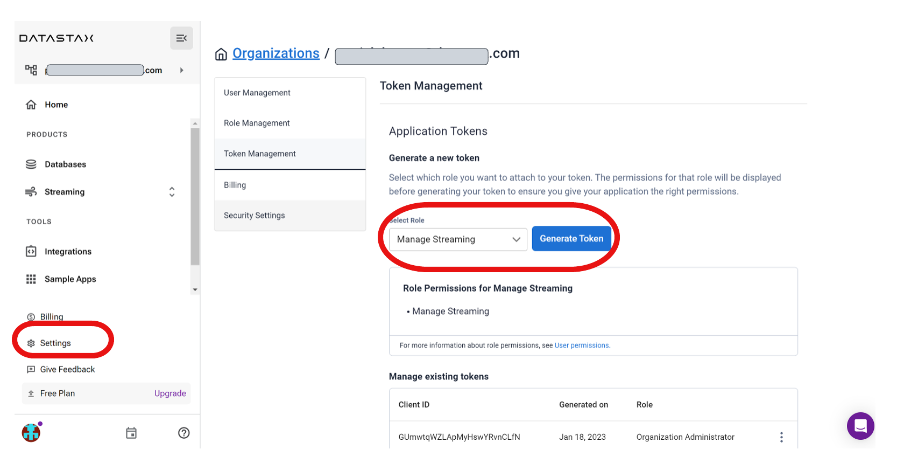
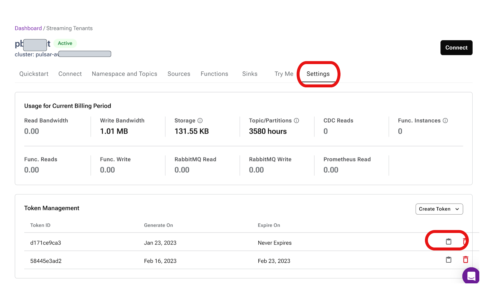

# Astra Streaming Replication Tester

- [Astra Streaming Replication Tester](#astra-streaming-replication-tester)
- [Overview - What is an Astra Streaming Replication Tester?](#overview---what-is-an-astra-streaming-replication-tester)
- [Assumptions and Prerequisites](#assumptions-and-prerequisites)
  - [Prerequisites](#prerequisites)
- [Setup](#setup)
  - [Update Conf files with JWT Tokens](#update-conf-files-with-jwt-tokens)
- [Running the Tester](#running-the-tester)
- [Shutdown and Cleanup](#shutdown-and-cleanup)

# Overview - What is an Astra Streaming Replication Tester?
This repo is a collection of scripts and configuration files, which automates the task of testing Astra Streaming Pulsar Cluster replication between 2 or more clusters.  It will setup and run Pulsar clients to generate a message workload (producers and consumers) to test the replication feature of Astra Streaming Pulsar clusters.
# Assumptions and Prerequisites  
This repo and tool set assumes the Astra Streaming / Pulsar clusters are running normally, ready for Pulsar clients to use.  
## Prerequisites
* Obtain Astra Streaming Org JWT "token" with at least "Manage Astra Streaming" role  
* Obtain an Astra Streaming Tenant JWT "token" for each  Pulsar instance in the clusters.  This is needed to setup Pulsar Namespaces and Topics needed for the tester clients.  
  
# Setup  
To start using this tool, copy or clone this repo to the machine(s) where you want to run the Pulsar clients.  This can be any Linux-based machine with access to all Astra Streaming / Pulsar clusters in this test.  

## Update Conf files with JWT Tokens

# Running the Tester  

# Shutdown and Cleanup  