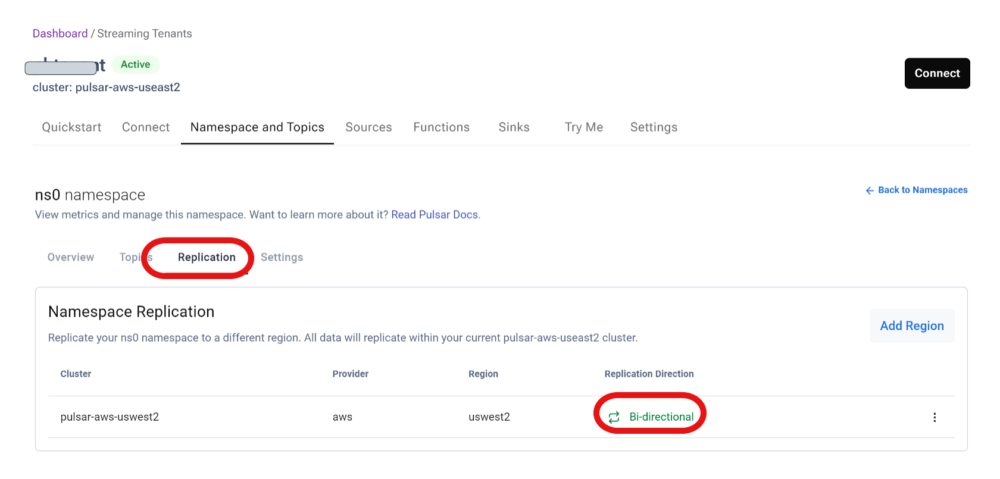
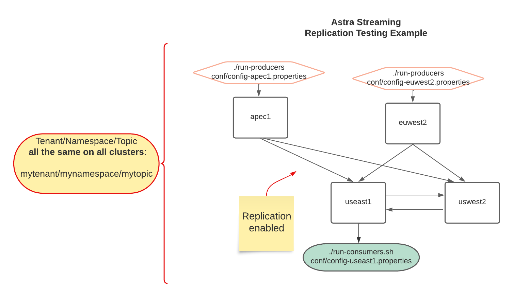

# Astra Streaming Replication Test

- [Astra Streaming Replication Test](#astra-streaming-replication-test)
- [Overview - What is an Astra Streaming Replication Test?](#overview---what-is-an-astra-streaming-replication-test)
- [Assumptions and Prerequisites](#assumptions-and-prerequisites)
  - [Assumptions](#assumptions)
  - [Prerequisites](#prerequisites)
- [Example Test Overview](#example-test-overview)
- [Setup](#setup)
  - [Update Conf files with Tenant, Namespace, Topic and JWT Token](#update-conf-files-with-tenant-namespace-topic-and-jwt-token)
- [Running the Replication Test](#running-the-replication-test)
- [Verify Results of the Replication Test](#verify-results-of-the-replication-test)

# Overview - What is an Astra Streaming Replication Test?
This repo is a collection of scripts and configuration files, which automates the task of testing Astra Streaming Pulsar Cluster replication between 2 or more clusters.  It allows you to quickly setup and run Pulsar clients to generate a message workload (producers and consumers) to test the replication feature of Astra Streaming Pulsar clusters.  
  
This repo uses the **bin/pulsar-perf** utility to create the message workload.  It is required to be install/setup on the machines where this repo is installed.  This can easily accomplished by installing a default, non-running, Pulsar instance.  

# Assumptions and Prerequisites  
This repo and tool set assumes the Astra Streaming / Pulsar clusters are running normally, ready for Pulsar clients to use.  
## Assumptions
* A tenant, namespace, and topic created and available for access by Pulsar clients.
* Replication is **enabled** at the namespace level 
## Prerequisites
* **bin/pulsar-perf** installed.  A default install of Pulsar is ok to use, it is not required to be running.  Only the pulsar-perf utility is used.
* Obtain the Astra Streaming connections details from the **Connect** screen.  You'll need the **Broker Service URL** and **Web Service URL** for the configuration files in this repo.
* Obtain an Astra Streaming Tenant JWT "token" for each  Pulsar instance in the clusters.  This is needed to setup Pulsar Namespaces and Topics needed for the tester clients.  

# Example Test Overview
For example, suppose you have need to test Astra Streaming replication as defined below:


This is easily accomplished by setting configuration properties files for each Pulsar Cluster in the diagram.  This allows you to start/run Producers and Consumers on any or all of the Pulsar Clusters, like shown in the diagram.  Messages published on one cluster, should be consumed on the "useast1" cluster, as shown in the diagram.

# Setup  
To start using this tool, copy or clone this repo to the machine(s) where you want to run the Pulsar clients.  This can be any Linux-based machine with access to all Astra Streaming / Pulsar clusters in this test.

## Update Conf files with Tenant, Namespace, Topic and JWT Token
Copy and update configuration files from [conf](conf/) directory.  There is 1 file for each Cloud/Region where Astra Streaming is deployed. 

```
authParams=<add Astra Streaming JWT Token here>
webServiceUrl=https://pulsar-aws-useast1.api.streaming.datastax.com

pulsar.tenant=<***add your tenant name>
pulsar.namespace=<***add namespace>
pulsar.topic=<***add topic name>
pulsar.topic.type=partitioned
#pulsar.topic.type=non-partitioned

# Location/Path to your pulsar-perf utility
pulsar.perf.location=~/pulsar/bin

# Adjust message size and rates below
message.pub.size=4096
message.pub.rate=500
# Name of subscriptions for consumers
message.subscription.name=<***your topic subscription name> 

brokerServiceUrl=pulsar+ssl://pulsar-aws-useast1.streaming.datastax.com:6651
authPlugin=org.apache.pulsar.client.impl.auth.AuthenticationToken
```
After the config files are updates, you can run the producer, consumer, and get-topic=stats scripts.  The Producer and Consumer script start "pulsar-perf" based on the config file parameters.  These Pulsar Perf clients run forever, until manually stopped.  
# Running the Replication Test

Execute the **run-consumer.sh** script, passing in the config file:   
```
scripts/run-consumer.sh conf/as-aws-useast1.properties
```
Execute the **run-producer.sh** script, passing in the config file:   
```
scripts/run-producer.sh conf/as-aws-useast1.properties
```
To see the message stats and topic state, run the **get-topic-stats.sh** script, passing in the config file:    
```
scripts/get-topic-stats.sh conf/as-aws-useast1.properties
```
# Verify Results of the Replication Test
Use the **get-topic-stats.sh** script to see real-time metrics on the replication.  Run this script while the producers and consumers are also running.  

Verify the **replication status** and backlogs to ensure replication is working normally.  Below is a snippet from the **gert-topic-stats.sh** script showing the replication metrics:
```
            "replication": {
                "pulsar-aws-uswest2": {
                    "msgRateIn": 0.0,
                    "msgThroughputIn": 0.0,
                    "msgRateOut": 0.0,
                    "msgThroughputOut": 0.0,
                    "msgRateExpired": 0.0,
                    "replicationBacklog": 0,
                    "connected": true,
                    "replicationDelayInSeconds": 0,
                    "inboundConnection": "/192.168.15.170:38808",
                    "inboundConnectedSince": "2023-03-27T14:08:52.116088Z",
                    "outboundConnection": "[id: 0x66a8fce2, L:/192.168.85.170:60756 - R:pulsar-aws-uswest2.streaming.datastax.com/35.81.143.133:6651]",
                    "outboundConnectedSince": "2023-03-27T14:08:51.297827Z"
                }
            },
```  
As shown above, **connected** is true, and **replicationBacklog** is Zero or low.  This indicates replication is working normally.  
